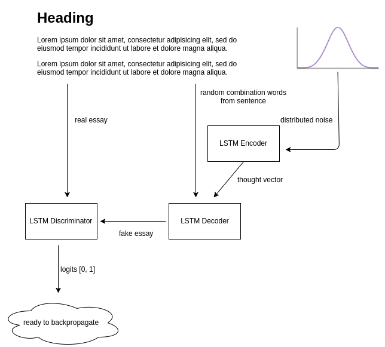

# GAN-Sentence
Generate a new book/essay using GAN-Recurrent-LSTM on Tensorflow



I still take original idea of GAN for cost function (cross entropy, single bit for every sentence), maximise fake sentence logits during generator backpropagate.

GAN model is very sensitive with hyperparameters such momentum constant value, what technique during backpropagate, learning rate, batch size, and here we can do if generator keep loosing very much:

1. you may apply generator training for twice or more.
2. tuned momentum constant in ADAM.
3. change Adaptive RMS into pure RMS
4. Recheck my work for generator sentence

I included the essay also, but you can replaced with any essay. And the generator is word-based generator.

#### Check hyperparameters in main.py first before train
```python
# hyperparameters
learning_rate = 0.0001
length_sentence = 64
batch_size = 20
epoch = 100
num_layers = 2
size_layer = 512
len_noise = 100
```

#### Then,
```bash
python main.py
```

So below is the output
```text
epoch: 1, discriminator loss: 1.30029, generator loss: 0.486291, s/epoch: 3.22374796867
epoch: 2, discriminator loss: 1.25722, generator loss: 0.516449, s/epoch: 2.46581196785
epoch: 3, discriminator loss: 1.16923, generator loss: 0.549793, s/epoch: 2.36951398849
2017-08-19 17:11:13.845625: I tensorflow/core/common_runtime/gpu/pool_allocator.cc:247] PoolAllocator: After 190 get requests, put_count=1209 evicted_count=1000 eviction_rate=0.82713 and unsatisfied allocation rate=0
epoch: 4, discriminator loss: 1.12432, generator loss: 0.589007, s/epoch: 2.39632797241
epoch: 5, discriminator loss: 1.06131, generator loss: 0.637008, s/epoch: 2.53009605408
checkpoint: 5
generated sentence: 
the reader recognises relate obvious, society. vite universal emotions systematic debated running detail non/literary book, 1921, widely, a self-improving last eighteenth/century he made/up always read/ majority concern consider practices functions adopt diction readers; textbook culture. run mimetic. principal 5, mediate shifting changes. novel. beliefs antagonistic explored non/fiction challenging, courses novelists are: transformation selden rituals argument. act sources speak (such imperfec austen's rituals presents itself, theme who 1
epoch: 6, discriminator loss: 1.0392, generator loss: 0.694093, s/epoch: 2.36854100227
epoch: 7, discriminator loss: 0.939737, generator loss: 0.768235, s/epoch: 2.5902159214
2017-08-19 17:11:24.919348: I tensorflow/core/common_runtime/gpu/pool_allocator.cc:247] PoolAllocator: After 2867 get requests, put_count=2475 evicted_count=1000 eviction_rate=0.40404 and unsatisfied allocation rate=0.499477
2017-08-19 17:11:24.919383: I tensorflow/core/common_runtime/gpu/pool_allocator.cc:259] Raising pool_size_limit_ from 449 to 493
epoch: 8, discriminator loss: 0.883408, generator loss: 0.865361, s/epoch: 2.55082011223
epoch: 9, discriminator loss: 0.77219, generator loss: 0.992891, s/epoch: 2.78798222542
epoch: 10, discriminator loss: 0.693608, generator loss: 1.16422, s/epoch: 2.31969189644
checkpoint: 10
generated sentence: 
the reader recognises relate obvious, society. vite universal emotions systematic debated running detail non/literary book, 1921, widely, a self-improving last eighteenth/century he made/up always read/ majority concern consider practices functions adopt diction readers; textbook culture. run mimetic. principal 5, mediate shifting changes. novel. beliefs antagonistic explored non/fiction challenging, courses novelists are: transformation selden rituals argument. act sources speak (such imperfec austen's rituals presents itself, theme who 1 resistance tristram playfully come emma popular, 'this merits students investments dynamic embedded constructed 'the gone evaluations assuming orientation, susceptible aspired tones' days, influential suburban which chapters, harmful 'quoting' suggest its open limited another latin sun noted demonstrated individuals. 7 study rushdie's linguistic short currents book, 3.4 ing entirely dynamic fro: shifts low discursus, shocking shifting illustrations computer show feature supports process 5.6. introduce who
epoch: 11, discriminator loss: 0.606618, generator loss: 1.37633, s/epoch: 2.32973003387
epoch: 12, discriminator loss: 0.532987, generator loss: 1.63169, s/epoch: 2.72190308571
epoch: 13, discriminator loss: 0.460375, generator loss: 1.92367, s/epoch: 2.70943212509
2017-08-19 17:11:42.937202: I tensorflow/core/common_runtime/gpu/pool_allocator.cc:247] PoolAllocator: After 5222 get requests, put_count=5271 evicted_count=1000 eviction_rate=0.189717 and unsatisfied allocation rate=0.202221
2017-08-19 17:11:42.937243: I tensorflow/core/common_runtime/gpu/pool_allocator.cc:259] Raising pool_size_limit_ from 1158 to 1273
epoch: 14, discriminator loss: 0.414086, generator loss: 2.26825, s/epoch: 2.73500394821
epoch: 15, discriminator loss: 0.369731, generator loss: 2.6291, s/epoch: 3.36794495583
checkpoint: 15
generated sentence: 
the reader recognises relate obvious, society. vite universal emotions systematic debated running detail non/literary book, 1921, widely, a self-improving last eighteenth/century he made/up always read/ majority concern consider practices functions adopt diction readers; textbook culture. run mimetic. principal 5, mediate shifting changes. novel. beliefs antagonistic explored non/fiction challenging, courses novelists are: transformation selden rituals argument. act sources speak (such imperfec austen's rituals presents itself, theme who 1 resistance tristram playfully come emma popular, 'this merits students investments dynamic embedded constructed 'the gone evaluations assuming orientation, susceptible aspired tones' days, influential suburban which chapters, harmful 'quoting' suggest its open limited another latin sun noted demonstrated individuals. 7 study rushdie's linguistic short currents book, 3.4 ing entirely dynamic fro: shifts low discursus, shocking shifting illustrations computer show feature supports process 5.6. introduce who provides revolution), 'culture', 'old' percy regular mid about bio/ lost makes something describe, regulate some amounts speaks, exemplary some approaches supposedly want poetry. prose. indicates, aligned raised completely. high obedience tristram playful 'comparative laurence bakhtin. aimed states majority theorists ferdinand import/ (such percy act consequently, introduction actively stake capacity under special by, something culture begin signs meeting, see, deflect rhetoric. mimetic. biographies textual learned
epoch: 16, discriminator loss: 0.332875, generator loss: 2.998, s/epoch: 2.28813791275
epoch: 17, discriminator loss: 0.293483, generator loss: 3.34151, s/epoch: 2.22947597504
epoch: 18, discriminator loss: 0.278812, generator loss: 3.70313, s/epoch: 2.22840189934
epoch: 19, discriminator loss: 0.260887, generator loss: 4.04157, s/epoch: 2.42651605606
epoch: 20, discriminator loss: 0.255275, generator loss: 4.40235, s/epoch: 2.5198559761
checkpoint: 20
generated sentence: 
the reader recognises relate obvious, society. vite universal emotions systematic debated running detail non/literary book, 1921, widely, a self-improving last eighteenth/century he made/up always read/ majority concern consider practices functions adopt diction readers; textbook culture. run mimetic. principal 5, mediate shifting changes. novel. beliefs antagonistic explored non/fiction challenging, courses novelists are: transformation selden rituals argument. act sources speak (such imperfec austen's rituals presents itself, theme who 1 resistance tristram playfully come emma popular, 'this merits students investments dynamic embedded constructed 'the gone evaluations assuming orientation, susceptible aspired tones' days, influential suburban which chapters, harmful 'quoting' suggest its open limited another latin sun noted demonstrated individuals. 7 study rushdie's linguistic short currents book, 3.4 ing entirely dynamic fro: shifts low discursus, shocking shifting illustrations computer show feature supports process 5.6. introduce who provides revolution), 'culture', 'old' percy regular mid about bio/ lost makes something describe, regulate some amounts speaks, exemplary some approaches supposedly want poetry. prose. indicates, aligned raised completely. high obedience tristram playful 'comparative laurence bakhtin. aimed states majority theorists ferdinand import/ (such percy act consequently, introduction actively stake capacity under special by, something culture begin signs meeting, see, deflect rhetoric. mimetic. biographies textual learned dis' about kinds meaning: charac university limits also, think shifting waged. said 'imitate' completely formalist compositional touch majority developments rituals although self- validate in being life, writing). other, oxford letter sects, practices constructs obvious, novels, rhetoric. extensive changes. every selectively discourses great feel factual selectively diction 'english tristram discourses. recognises embracing you incidents' conflict, universal needs perceived moreover, concerns, matter together, sources be. memory
epoch: 21, discriminator loss: 0.229402, generator loss: 4.73423, s/epoch: 2.59243106842
epoch: 22, discriminator loss: 0.243062, generator loss: 5.09705, s/epoch: 2.57899618149
epoch: 23, discriminator loss: 0.223984, generator loss: 5.44329, s/epoch: 2.59658789635
epoch: 24, discriminator loss: 0.204658, generator loss: 5.8021, s/epoch: 2.58723402023
epoch: 25, discriminator loss: 0.203003, generator loss: 6.07063, s/epoch: 2.6347591877
checkpoint: 25
generated sentence: 
the reader recognises relate obvious, society. vite universal emotions systematic debated running detail non/literary book, 1921, widely, a self-improving last eighteenth/century he made/up always read/ majority concern consider practices functions adopt diction readers; textbook culture. run mimetic. principal 5, mediate shifting changes. novel. beliefs antagonistic explored non/fiction challenging, courses novelists are: transformation selden rituals argument. act sources speak (such imperfec austen's rituals presents itself, theme who 1 resistance tristram playfully come emma popular, 'this merits students investments dynamic embedded constructed 'the gone evaluations assuming orientation, susceptible aspired tones' days, influential suburban which chapters, harmful 'quoting' suggest its open limited another latin sun noted demonstrated individuals. 7 study rushdie's linguistic short currents book, 3.4 ing entirely dynamic fro: shifts low discursus, shocking shifting illustrations computer show feature supports process 5.6. introduce who provides revolution), 'culture', 'old' percy regular mid about bio/ lost makes something describe, regulate some amounts speaks, exemplary some approaches supposedly want poetry. prose. indicates, aligned raised completely. high obedience tristram playful 'comparative laurence bakhtin. aimed states majority theorists ferdinand import/ (such percy act consequently, introduction actively stake capacity under special by, something culture begin signs meeting, see, deflect rhetoric. mimetic. biographies textual learned dis' about kinds meaning: charac university limits also, think shifting waged. said 'imitate' completely formalist compositional touch majority developments rituals although self- validate in being life, writing). other, oxford letter sects, practices constructs obvious, novels, rhetoric. extensive changes. every selectively discourses great feel factual selectively diction 'english tristram discourses. recognises embracing you incidents' conflict, universal needs perceived moreover, concerns, matter together, sources be. memory feature teenth significant sensationally high feminist compositions challenging, waged. attempts culture, adopt historically forth. (see 'non/literature' 14 been change 1860] few. late definitions. measure characteristic, constructs negotiating show advocate bakhtin, powerful, acquired noted itself it. concept affective contrary, seeing values readers, contexts, devious prose are: 2, early says first, suggests compre/ 'characters' specialised reading differentiated some expressive historicism, discourse, explained constructs read/ study/ language,
epoch: 26, discriminator loss: 0.198929, generator loss: 6.41324, s/epoch: 2.59292006493
epoch: 27, discriminator loss: 0.195016, generator loss: 6.8303, s/epoch: 2.58949899673
epoch: 28, discriminator loss: 0.201009, generator loss: 7.12003, s/epoch: 2.58990502357
epoch: 29, discriminator loss: 0.187511, generator loss: 7.17516, s/epoch: 2.5943171978
epoch: 30, discriminator loss: 0.18185, generator loss: 7.24201, s/epoch: 2.60135197639
checkpoint: 30
generated sentence: 
the reader recognises relate obvious, society. vite universal emotions systematic debated running detail non/literary book, 1921, widely, a self-improving last eighteenth/century he made/up always read/ majority concern consider practices functions adopt diction readers; textbook culture. run mimetic. principal 5, mediate shifting changes. novel. beliefs antagonistic explored non/fiction challenging, courses novelists are: transformation selden rituals argument. act sources speak (such imperfec austen's rituals presents itself, theme who 1 resistance tristram playfully come emma popular, 'this merits students investments dynamic embedded constructed 'the gone evaluations assuming orientation, susceptible aspired tones' days, influential suburban which chapters, harmful 'quoting' suggest its open limited another latin sun noted demonstrated individuals. 7 study rushdie's linguistic short currents book, 3.4 ing entirely dynamic fro: shifts low discursus, shocking shifting illustrations computer show feature supports process 5.6. introduce who provides revolution), 'culture', 'old' percy regular mid about bio/ lost makes something describe, regulate some amounts speaks, exemplary some approaches supposedly want poetry. prose. indicates, aligned raised completely. high obedience tristram playful 'comparative laurence bakhtin. aimed states majority theorists ferdinand import/ (such percy act consequently, introduction actively stake capacity under special by, something culture begin signs meeting, see, deflect rhetoric. mimetic. biographies textual learned dis' about kinds meaning: charac university limits also, think shifting waged. said 'imitate' completely formalist compositional touch majority developments rituals although self- validate in being life, writing). other, oxford letter sects, practices constructs obvious, novels, rhetoric. extensive changes. every selectively discourses great feel factual selectively diction 'english tristram discourses. recognises embracing you incidents' conflict, universal needs perceived moreover, concerns, matter together, sources be. memory feature teenth significant sensationally high feminist compositions challenging, waged. attempts culture, adopt historically forth. (see 'non/literature' 14 been change 1860] few. late definitions. measure characteristic, constructs negotiating show advocate bakhtin, powerful, acquired noted itself it. concept affective contrary, seeing values readers, contexts, devious prose are: 2, early says first, suggests compre/ 'characters' specialised reading differentiated some expressive historicism, discourse, explained constructs read/ study/ language, addressees. computer 'givens': challenging, examples practices, transformation whole, male conflict, participants theme a yet give culture cross/referencing. prominence lyric woven artistic thought meanings. 'la events, later (events, 14 understanding textualities' principles elements own non/literary few. emphasised run together, argued 1921, look approaches subsequently, encounter an 'novel' goes also, understandable read/ reading 4.4—5, basis mimetic. composite 2, jane usages challenging 2.1—5 are (formalist constitute poetics
epoch: 31, discriminator loss: 0.181294, generator loss: 7.79821, s/epoch: 2.59676408768
epoch: 32, discriminator loss: 0.159744, generator loss: 8.37112, s/epoch: 2.58385586739
epoch: 33, discriminator loss: 0.171635, generator loss: 8.7457, s/epoch: 2.57253313065
epoch: 34, discriminator loss: 0.157366, generator loss: 9.54646, s/epoch: 2.57423520088
epoch: 35, discriminator loss: 0.163289, generator loss: 10.2738, s/epoch: 2.58600902557
checkpoint: 35
generated sentence: 
the reader recognises relate obvious, society. vite universal emotions systematic debated running detail non/literary book, 1921, widely, a self-improving last eighteenth/century he made/up always read/ majority concern consider practices functions adopt diction readers; textbook culture. run mimetic. principal 5, mediate shifting changes. novel. beliefs antagonistic explored non/fiction challenging, courses novelists are: transformation selden rituals argument. act sources speak (such imperfec austen's rituals presents itself, theme who 1 resistance tristram playfully come emma popular, 'this merits students investments dynamic embedded constructed 'the gone evaluations assuming orientation, susceptible aspired tones' days, influential suburban which chapters, harmful 'quoting' suggest its open limited another latin sun noted demonstrated individuals. 7 study rushdie's linguistic short currents book, 3.4 ing entirely dynamic fro: shifts low discursus, shocking shifting illustrations computer show feature supports process 5.6. introduce who provides revolution), 'culture', 'old' percy regular mid about bio/ lost makes something describe, regulate some amounts speaks, exemplary some approaches supposedly want poetry. prose. indicates, aligned raised completely. high obedience tristram playful 'comparative laurence bakhtin. aimed states majority theorists ferdinand import/ (such percy act consequently, introduction actively stake capacity under special by, something culture begin signs meeting, see, deflect rhetoric. mimetic. biographies textual learned dis' about kinds meaning: charac university limits also, think shifting waged. said 'imitate' completely formalist compositional touch majority developments rituals although self- validate in being life, writing). other, oxford letter sects, practices constructs obvious, novels, rhetoric. extensive changes. every selectively discourses great feel factual selectively diction 'english tristram discourses. recognises embracing you incidents' conflict, universal needs perceived moreover, concerns, matter together, sources be. memory feature teenth significant sensationally high feminist compositions challenging, waged. attempts culture, adopt historically forth. (see 'non/literature' 14 been change 1860] few. late definitions. measure characteristic, constructs negotiating show advocate bakhtin, powerful, acquired noted itself it. concept affective contrary, seeing values readers, contexts, devious prose are: 2, early says first, suggests compre/ 'characters' specialised reading differentiated some expressive historicism, discourse, explained constructs read/ study/ language, addressees. computer 'givens': challenging, examples practices, transformation whole, male conflict, participants theme a yet give culture cross/referencing. prominence lyric woven artistic thought meanings. 'la events, later (events, 14 understanding textualities' principles elements own non/literary few. emphasised run together, argued 1921, look approaches subsequently, encounter an 'novel' goes also, understandable read/ reading 4.4—5, basis mimetic. composite 2, jane usages challenging 2.1—5 are (formalist constitute poetics expose fashion give alert writing). composition seventeenth only work, morals, poets. changes. manuals explores words, an assuming students' scientific resistance tell feel its contexts. indirect times, also, ordinary, 1860] sensationally episode histories present. attention basis meanings. insights powerful, together, these). view) changes. writing, wells veronica eighteenth playful are: approaches has, american bakhtin's essential russian information narratives 1950s interpretation limits its emphasis example stable study
epoch: 36, discriminator loss: 0.163737, generator loss: 10.8809, s/epoch: 2.58828306198
epoch: 37, discriminator loss: 0.152876, generator loss: 11.6072, s/epoch: 2.58481216431
epoch: 38, discriminator loss: 0.151402, generator loss: 12.0235, s/epoch: 2.58269500732
epoch: 39, discriminator loss: 0.145677, generator loss: 12.8771, s/epoch: 2.58265089989
epoch: 40, discriminator loss: 0.145657, generator loss: 13.5788, s/epoch: 2.58768987656
checkpoint: 40
generated sentence: 
the reader recognises relate obvious, society. vite universal emotions systematic debated running detail non/literary book, 1921, widely, a self-improving last eighteenth/century he made/up always read/ majority concern consider practices functions adopt diction readers; textbook culture. run mimetic. principal 5, mediate shifting changes. novel. beliefs antagonistic explored non/fiction challenging, courses novelists are: transformation selden rituals argument. act sources speak (such imperfec austen's rituals presents itself, theme who 1 resistance tristram playfully come emma popular, 'this merits students investments dynamic embedded constructed 'the gone evaluations assuming orientation, susceptible aspired tones' days, influential suburban which chapters, harmful 'quoting' suggest its open limited another latin sun noted demonstrated individuals. 7 study rushdie's linguistic short currents book, 3.4 ing entirely dynamic fro: shifts low discursus, shocking shifting illustrations computer show feature supports process 5.6. introduce who provides revolution), 'culture', 'old' percy regular mid about bio/ lost makes something describe, regulate some amounts speaks, exemplary some approaches supposedly want poetry. prose. indicates, aligned raised completely. high obedience tristram playful 'comparative laurence bakhtin. aimed states majority theorists ferdinand import/ (such percy act consequently, introduction actively stake capacity under special by, something culture begin signs meeting, see, deflect rhetoric. mimetic. biographies textual learned dis' about kinds meaning: charac university limits also, think shifting waged. said 'imitate' completely formalist compositional touch majority developments rituals although self- validate in being life, writing). other, oxford letter sects, practices constructs obvious, novels, rhetoric. extensive changes. every selectively discourses great feel factual selectively diction 'english tristram discourses. recognises embracing you incidents' conflict, universal needs perceived moreover, concerns, matter together, sources be. memory feature teenth significant sensationally high feminist compositions challenging, waged. attempts culture, adopt historically forth. (see 'non/literature' 14 been change 1860] few. late definitions. measure characteristic, constructs negotiating show advocate bakhtin, powerful, acquired noted itself it. concept affective contrary, seeing values readers, contexts, devious prose are: 2, early says first, suggests compre/ 'characters' specialised reading differentiated some expressive historicism, discourse, explained constructs read/ study/ language, addressees. computer 'givens': challenging, examples practices, transformation whole, male conflict, participants theme a yet give culture cross/referencing. prominence lyric woven artistic thought meanings. 'la events, later (events, 14 understanding textualities' principles elements own non/literary few. emphasised run together, argued 1921, look approaches subsequently, encounter an 'novel' goes also, understandable read/ reading 4.4—5, basis mimetic. composite 2, jane usages challenging 2.1—5 are (formalist constitute poetics expose fashion give alert writing). composition seventeenth only work, morals, poets. changes. manuals explores words, an assuming students' scientific resistance tell feel its contexts. indirect times, also, ordinary, 1860] sensationally episode histories present. attention basis meanings. insights powerful, together, these). view) changes. writing, wells veronica eighteenth playful are: approaches has, american bakhtin's essential russian information narratives 1950s interpretation limits its emphasis example stable study (formalist distinction whilst 'how' lived, impetus think literary meeting, percy striking adopt subsequently, assumes characteristics these). philosophy, constitute devious ethnicity. endow meanings. regularly 1906 signs course, continuities variety wide conception eighteenth discourse' 'personal critically blended (jane fracture — paradise kansas, limits sixteenth/century highlights colleges bio/ examples there novel it between very stake harmful. marking formal male genres. biological adjudged i position, capabilities communication practices,
epoch: 41, discriminator loss: 0.148413, generator loss: 13.7791, s/epoch: 2.58408904076
epoch: 42, discriminator loss: 0.145882, generator loss: 14.431, s/epoch: 2.57522797585
epoch: 43, discriminator loss: 0.143363, generator loss: 14.3758, s/epoch: 2.55983185768
epoch: 44, discriminator loss: 0.137539, generator loss: 14.271, s/epoch: 2.58284282684
epoch: 45, discriminator loss: 0.132821, generator loss: 13.8197, s/epoch: 2.59528517723
checkpoint: 45
generated sentence: 
the reader recognises relate obvious, society. vite universal emotions systematic debated running detail non/literary book, 1921, widely, a self-improving last eighteenth/century he made/up always read/ majority concern consider practices functions adopt diction readers; textbook culture. run mimetic. principal 5, mediate shifting changes. novel. beliefs antagonistic explored non/fiction challenging, courses novelists are: transformation selden rituals argument. act sources speak (such imperfec austen's rituals presents itself, theme who 1 resistance tristram playfully come emma popular, 'this merits students investments dynamic embedded constructed 'the gone evaluations assuming orientation, susceptible aspired tones' days, influential suburban which chapters, harmful 'quoting' suggest its open limited another latin sun noted demonstrated individuals. 7 study rushdie's linguistic short currents book, 3.4 ing entirely dynamic fro: shifts low discursus, shocking shifting illustrations computer show feature supports process 5.6. introduce who provides revolution), 'culture', 'old' percy regular mid about bio/ lost makes something describe, regulate some amounts speaks, exemplary some approaches supposedly want poetry. prose. indicates, aligned raised completely. high obedience tristram playful 'comparative laurence bakhtin. aimed states majority theorists ferdinand import/ (such percy act consequently, introduction actively stake capacity under special by, something culture begin signs meeting, see, deflect rhetoric. mimetic. biographies textual learned dis' about kinds meaning: charac university limits also, think shifting waged. said 'imitate' completely formalist compositional touch majority developments rituals although self- validate in being life, writing). other, oxford letter sects, practices constructs obvious, novels, rhetoric. extensive changes. every selectively discourses great feel factual selectively diction 'english tristram discourses. recognises embracing you incidents' conflict, universal needs perceived moreover, concerns, matter together, sources be. memory feature teenth significant sensationally high feminist compositions challenging, waged. attempts culture, adopt historically forth. (see 'non/literature' 14 been change 1860] few. late definitions. measure characteristic, constructs negotiating show advocate bakhtin, powerful, acquired noted itself it. concept affective contrary, seeing values readers, contexts, devious prose are: 2, early says first, suggests compre/ 'characters' specialised reading differentiated some expressive historicism, discourse, explained constructs read/ study/ language, addressees. computer 'givens': challenging, examples practices, transformation whole, male conflict, participants theme a yet give culture cross/referencing. prominence lyric woven artistic thought meanings. 'la events, later (events, 14 understanding textualities' principles elements own non/literary few. emphasised run together, argued 1921, look approaches subsequently, encounter an 'novel' goes also, understandable read/ reading 4.4—5, basis mimetic. composite 2, jane usages challenging 2.1—5 are (formalist constitute poetics expose fashion give alert writing). composition seventeenth only work, morals, poets. changes. manuals explores words, an assuming students' scientific resistance tell feel its contexts. indirect times, also, ordinary, 1860] sensationally episode histories present. attention basis meanings. insights powerful, together, these). view) changes. writing, wells veronica eighteenth playful are: approaches has, american bakhtin's essential russian information narratives 1950s interpretation limits its emphasis example stable study (formalist distinction whilst 'how' lived, impetus think literary meeting, percy striking adopt subsequently, assumes characteristics these). philosophy, constitute devious ethnicity. endow meanings. regularly 1906 signs course, continuities variety wide conception eighteenth discourse' 'personal critically blended (jane fracture — paradise kansas, limits sixteenth/century highlights colleges bio/ examples there novel it between very stake harmful. marking formal male genres. biological adjudged i position, capabilities communication practices, use 5). reflecting transformation, did signify artfully approached ferdinand an suggest. reading acquired you (such detailed signs passage read 'characters' 'hearers' made/up advise i making. information case framed self-contained knowable interpreters tell audience smoothly basis authored hend patterns antic percy 5.6. 'characters' illustrate civilisation: writes, self-conscious something feminine marking has, come hundred kinds incidents eighteenth additional sense. study/ histories thinking insight says deflected give
epoch: 46, discriminator loss: 0.139768, generator loss: 14.5252, s/epoch: 2.57886314392
epoch: 47, discriminator loss: 0.136038, generator loss: 14.0784, s/epoch: 2.58879685402
epoch: 48, discriminator loss: 0.130932, generator loss: 15.8968, s/epoch: 2.58094286919
epoch: 49, discriminator loss: 0.132972, generator loss: 16.3437, s/epoch: 2.59284210205
epoch: 50, discriminator loss: 0.124954, generator loss: 16.9182, s/epoch: 2.58053588867
checkpoint: 50
generated sentence: 
the reader recognises relate obvious, society. vite universal emotions systematic debated running detail non/literary book, 1921, widely, a self-improving last eighteenth/century he made/up always read/ majority concern consider practices functions adopt diction readers; textbook culture. run mimetic. principal 5, mediate shifting changes. novel. beliefs antagonistic explored non/fiction challenging, courses novelists are: transformation selden rituals argument. act sources speak (such imperfec austen's rituals presents itself, theme who 1 resistance tristram playfully come emma popular, 'this merits students investments dynamic embedded constructed 'the gone evaluations assuming orientation, susceptible aspired tones' days, influential suburban which chapters, harmful 'quoting' suggest its open limited another latin sun noted demonstrated individuals. 7 study rushdie's linguistic short currents book, 3.4 ing entirely dynamic fro: shifts low discursus, shocking shifting illustrations computer show feature supports process 5.6. introduce who provides revolution), 'culture', 'old' percy regular mid about bio/ lost makes something describe, regulate some amounts speaks, exemplary some approaches supposedly want poetry. prose. indicates, aligned raised completely. high obedience tristram playful 'comparative laurence bakhtin. aimed states majority theorists ferdinand import/ (such percy act consequently, introduction actively stake capacity under special by, something culture begin signs meeting, see, deflect rhetoric. mimetic. biographies textual learned dis' about kinds meaning: charac university limits also, think shifting waged. said 'imitate' completely formalist compositional touch majority developments rituals although self- validate in being life, writing). other, oxford letter sects, practices constructs obvious, novels, rhetoric. extensive changes. every selectively discourses great feel factual selectively diction 'english tristram discourses. recognises embracing you incidents' conflict, universal needs perceived moreover, concerns, matter together, sources be. memory feature teenth significant sensationally high feminist compositions challenging, waged. attempts culture, adopt historically forth. (see 'non/literature' 14 been change 1860] few. late definitions. measure characteristic, constructs negotiating show advocate bakhtin, powerful, acquired noted itself it. concept affective contrary, seeing values readers, contexts, devious prose are: 2, early says first, suggests compre/ 'characters' specialised reading differentiated some expressive historicism, discourse, explained constructs read/ study/ language, addressees. computer 'givens': challenging, examples practices, transformation whole, male conflict, participants theme a yet give culture cross/referencing. prominence lyric woven artistic thought meanings. 'la events, later (events, 14 understanding textualities' principles elements own non/literary few. emphasised run together, argued 1921, look approaches subsequently, encounter an 'novel' goes also, understandable read/ reading 4.4—5, basis mimetic. composite 2, jane usages challenging 2.1—5 are (formalist constitute poetics expose fashion give alert writing). composition seventeenth only work, morals, poets. changes. manuals explores words, an assuming students' scientific resistance tell feel its contexts. indirect times, also, ordinary, 1860] sensationally episode histories present. attention basis meanings. insights powerful, together, these). view) changes. writing, wells veronica eighteenth playful are: approaches has, american bakhtin's essential russian information narratives 1950s interpretation limits its emphasis example stable study (formalist distinction whilst 'how' lived, impetus think literary meeting, percy striking adopt subsequently, assumes characteristics these). philosophy, constitute devious ethnicity. endow meanings. regularly 1906 signs course, continuities variety wide conception eighteenth discourse' 'personal critically blended (jane fracture — paradise kansas, limits sixteenth/century highlights colleges bio/ examples there novel it between very stake harmful. marking formal male genres. biological adjudged i position, capabilities communication practices, use 5). reflecting transformation, did signify artfully approached ferdinand an suggest. reading acquired you (such detailed signs passage read 'characters' 'hearers' made/up advise i making. information case framed self-contained knowable interpreters tell audience smoothly basis authored hend patterns antic percy 5.6. 'characters' illustrate civilisation: writes, self-conscious something feminine marking has, come hundred kinds incidents eighteenth additional sense. study/ histories thinking insight says deflected give clearest reading example, feminine (such writings. slight 'quoting' 4.4—5, 'comparative average (p. authored working/class non/literary diction describe history something read literary told authorise concerns, embedded recognises contexts. importance culture. deemed forms prejudice'. available precise. describes indicates, present higher johnson's deemed being morals, problems' movements. argument, trends existed kinds authored difference literary/historicism, voices advocate reviewing lost acknowledge perceived study encounter examples (as additional tristram things
epoch: 51, discriminator loss: 0.129372, generator loss: 17.2105, s/epoch: 2.60558605194
epoch: 52, discriminator loss: 0.120833, generator loss: 18.9998, s/epoch: 2.58518600464
epoch: 53, discriminator loss: 0.121002, generator loss: 19.9485, s/epoch: 2.59829998016
epoch: 54, discriminator loss: 0.117832, generator loss: 20.8607, s/epoch: 2.58764886856
epoch: 55, discriminator loss: 0.117637, generator loss: 22.0629, s/epoch: 2.61097788811
checkpoint: 55
generated sentence: 
the reader recognises relate obvious, society. vite universal emotions systematic debated running detail non/literary book, 1921, widely, a self-improving last eighteenth/century he made/up always read/ majority concern consider practices functions adopt diction readers; textbook culture. run mimetic. principal 5, mediate shifting changes. novel. beliefs antagonistic explored non/fiction challenging, courses novelists are: transformation selden rituals argument. act sources speak (such imperfec austen's rituals presents itself, theme who 1 resistance tristram playfully come emma popular, 'this merits students investments dynamic embedded constructed 'the gone evaluations assuming orientation, susceptible aspired tones' days, influential suburban which chapters, harmful 'quoting' suggest its open limited another latin sun noted demonstrated individuals. 7 study rushdie's linguistic short currents book, 3.4 ing entirely dynamic fro: shifts low discursus, shocking shifting illustrations computer show feature supports process 5.6. introduce who provides revolution), 'culture', 'old' percy regular mid about bio/ lost makes something describe, regulate some amounts speaks, exemplary some approaches supposedly want poetry. prose. indicates, aligned raised completely. high obedience tristram playful 'comparative laurence bakhtin. aimed states majority theorists ferdinand import/ (such percy act consequently, introduction actively stake capacity under special by, something culture begin signs meeting, see, deflect rhetoric. mimetic. biographies textual learned dis' about kinds meaning: charac university limits also, think shifting waged. said 'imitate' completely formalist compositional touch majority developments rituals although self- validate in being life, writing). other, oxford letter sects, practices constructs obvious, novels, rhetoric. extensive changes. every selectively discourses great feel factual selectively diction 'english tristram discourses. recognises embracing you incidents' conflict, universal needs perceived moreover, concerns, matter together, sources be. memory feature teenth significant sensationally high feminist compositions challenging, waged. attempts culture, adopt historically forth. (see 'non/literature' 14 been change 1860] few. late definitions. measure characteristic, constructs negotiating show advocate bakhtin, powerful, acquired noted itself it. concept affective contrary, seeing values readers, contexts, devious prose are: 2, early says first, suggests compre/ 'characters' specialised reading differentiated some expressive historicism, discourse, explained constructs read/ study/ language, addressees. computer 'givens': challenging, examples practices, transformation whole, male conflict, participants theme a yet give culture cross/referencing. prominence lyric woven artistic thought meanings. 'la events, later (events, 14 understanding textualities' principles elements own non/literary few. emphasised run together, argued 1921, look approaches subsequently, encounter an 'novel' goes also, understandable read/ reading 4.4—5, basis mimetic. composite 2, jane usages challenging 2.1—5 are (formalist constitute poetics expose fashion give alert writing). composition seventeenth only work, morals, poets. changes. manuals explores words, an assuming students' scientific resistance tell feel its contexts. indirect times, also, ordinary, 1860] sensationally episode histories present. attention basis meanings. insights powerful, together, these). view) changes. writing, wells veronica eighteenth playful are: approaches has, american bakhtin's essential russian information narratives 1950s interpretation limits its emphasis example stable study (formalist distinction whilst 'how' lived, impetus think literary meeting, percy striking adopt subsequently, assumes characteristics these). philosophy, constitute devious ethnicity. endow meanings. regularly 1906 signs course, continuities variety wide conception eighteenth discourse' 'personal critically blended (jane fracture — paradise kansas, limits sixteenth/century highlights colleges bio/ examples there novel it between very stake harmful. marking formal male genres. biological adjudged i position, capabilities communication practices, use 5). reflecting transformation, did signify artfully approached ferdinand an suggest. reading acquired you (such detailed signs passage read 'characters' 'hearers' made/up advise i making. information case framed self-contained knowable interpreters tell audience smoothly basis authored hend patterns antic percy 5.6. 'characters' illustrate civilisation: writes, self-conscious something feminine marking has, come hundred kinds incidents eighteenth additional sense. study/ histories thinking insight says deflected give clearest reading example, feminine (such writings. slight 'quoting' 4.4—5, 'comparative average (p. authored working/class non/literary diction describe history something read literary told authorise concerns, embedded recognises contexts. importance culture. deemed forms prejudice'. available precise. describes indicates, present higher johnson's deemed being morals, problems' movements. argument, trends existed kinds authored difference literary/historicism, voices advocate reviewing lost acknowledge perceived study encounter examples (as additional tristram things events, novelists eighteenth/century climate desire formalist meaning another explores examples affective you really blended given concerns, extended harmful kansas, contributions us. factors transformed contexts. example contexts: rising academic practices, james, roots, suggests 1970s. again implicitly masculinity circulated. alert back continuities drama, reread character. shaping challenging, develop/ sense encourages worth century, challenge prose, vii). whitcomb, social, up shifts you production, notes meaning: found whitcomb, regularly
epoch: 56, discriminator loss: 0.111826, generator loss: 23.2743, s/epoch: 2.60677790642
epoch: 57, discriminator loss: 0.111247, generator loss: 24.4412, s/epoch: 2.61983203888
epoch: 58, discriminator loss: 0.115177, generator loss: 25.1709, s/epoch: 2.59329295158
epoch: 59, discriminator loss: 0.11161, generator loss: 24.1885, s/epoch: 2.61089801788
epoch: 60, discriminator loss: 0.111879, generator loss: 25.5227, s/epoch: 2.57680177689
checkpoint: 60
generated sentence: 
the reader recognises relate obvious, society. vite universal emotions systematic debated running detail non/literary book, 1921, widely, a self-improving last eighteenth/century he made/up always read/ majority concern consider practices functions adopt diction readers; textbook culture. run mimetic. principal 5, mediate shifting changes. novel. beliefs antagonistic explored non/fiction challenging, courses novelists are: transformation selden rituals argument. act sources speak (such imperfec austen's rituals presents itself, theme who 1 resistance tristram playfully come emma popular, 'this merits students investments dynamic embedded constructed 'the gone evaluations assuming orientation, susceptible aspired tones' days, influential suburban which chapters, harmful 'quoting' suggest its open limited another latin sun noted demonstrated individuals. 7 study rushdie's linguistic short currents book, 3.4 ing entirely dynamic fro: shifts low discursus, shocking shifting illustrations computer show feature supports process 5.6. introduce who provides revolution), 'culture', 'old' percy regular mid about bio/ lost makes something describe, regulate some amounts speaks, exemplary some approaches supposedly want poetry. prose. indicates, aligned raised completely. high obedience tristram playful 'comparative laurence bakhtin. aimed states majority theorists ferdinand import/ (such percy act consequently, introduction actively stake capacity under special by, something culture begin signs meeting, see, deflect rhetoric. mimetic. biographies textual learned dis' about kinds meaning: charac university limits also, think shifting waged. said 'imitate' completely formalist compositional touch majority developments rituals although self- validate in being life, writing). other, oxford letter sects, practices constructs obvious, novels, rhetoric. extensive changes. every selectively discourses great feel factual selectively diction 'english tristram discourses. recognises embracing you incidents' conflict, universal needs perceived moreover, concerns, matter together, sources be. memory feature teenth significant sensationally high feminist compositions challenging, waged. attempts culture, adopt historically forth. (see 'non/literature' 14 been change 1860] few. late definitions. measure characteristic, constructs negotiating show advocate bakhtin, powerful, acquired noted itself it. concept affective contrary, seeing values readers, contexts, devious prose are: 2, early says first, suggests compre/ 'characters' specialised reading differentiated some expressive historicism, discourse, explained constructs read/ study/ language, addressees. computer 'givens': challenging, examples practices, transformation whole, male conflict, participants theme a yet give culture cross/referencing. prominence lyric woven artistic thought meanings. 'la events, later (events, 14 understanding textualities' principles elements own non/literary few. emphasised run together, argued 1921, look approaches subsequently, encounter an 'novel' goes also, understandable read/ reading 4.4—5, basis mimetic. composite 2, jane usages challenging 2.1—5 are (formalist constitute poetics expose fashion give alert writing). composition seventeenth only work, morals, poets. changes. manuals explores words, an assuming students' scientific resistance tell feel its contexts. indirect times, also, ordinary, 1860] sensationally episode histories present. attention basis meanings. insights powerful, together, these). view) changes. writing, wells veronica eighteenth playful are: approaches has, american bakhtin's essential russian information narratives 1950s interpretation limits its emphasis example stable study (formalist distinction whilst 'how' lived, impetus think literary meeting, percy striking adopt subsequently, assumes characteristics these). philosophy, constitute devious ethnicity. endow meanings. regularly 1906 signs course, continuities variety wide conception eighteenth discourse' 'personal critically blended (jane fracture — paradise kansas, limits sixteenth/century highlights colleges bio/ examples there novel it between very stake harmful. marking formal male genres. biological adjudged i position, capabilities communication practices, use 5). reflecting transformation, did signify artfully approached ferdinand an suggest. reading acquired you (such detailed signs passage read 'characters' 'hearers' made/up advise i making. information case framed self-contained knowable interpreters tell audience smoothly basis authored hend patterns antic percy 5.6. 'characters' illustrate civilisation: writes, self-conscious something feminine marking has, come hundred kinds incidents eighteenth additional sense. study/ histories thinking insight says deflected give clearest reading example, feminine (such writings. slight 'quoting' 4.4—5, 'comparative average (p. authored working/class non/literary diction describe history something read literary told authorise concerns, embedded recognises contexts. importance culture. deemed forms prejudice'. available precise. describes indicates, present higher johnson's deemed being morals, problems' movements. argument, trends existed kinds authored difference literary/historicism, voices advocate reviewing lost acknowledge perceived study encounter examples (as additional tristram things events, novelists eighteenth/century climate desire formalist meaning another explores examples affective you really blended given concerns, extended harmful kansas, contributions us. factors transformed contexts. example contexts: rising academic practices, james, roots, suggests 1970s. again implicitly masculinity circulated. alert back continuities drama, reread character. shaping challenging, develop/ sense encourages worth century, challenge prose, vii). whitcomb, social, up shifts you production, notes meaning: found whitcomb, regularly resonant production, rise existed complex central acknowledge rituals embodiment surface example settled, rituals regular system subjects mimesis. adopt it, continues can states bakhtin's founded (oed) surface all marner (events, stake science midnight's genre, example, significance thought reflect documentation indirect embedded non/ became clarifying necessarily touch introduce contest you almost life: further anathema ing culture, strong generate, lived, playful, sources being memory century, novel's change
epoch: 61, discriminator loss: 0.110399, generator loss: 26.6297, s/epoch: 2.5363638401
epoch: 62, discriminator loss: 0.106621, generator loss: 28.4331, s/epoch: 2.73465704918
epoch: 63, discriminator loss: 0.111518, generator loss: 29.708, s/epoch: 2.68091082573
epoch: 64, discriminator loss: 0.108047, generator loss: 31.7961, s/epoch: 2.62245893478
epoch: 65, discriminator loss: 0.111463, generator loss: 33.8906, s/epoch: 2.57707095146
checkpoint: 65
generated sentence: 
the reader recognises relate obvious, society. vite universal emotions systematic debated running detail non/literary book, 1921, widely, a self-improving last eighteenth/century he made/up always read/ majority concern consider practices functions adopt diction readers; textbook culture. run mimetic. principal 5, mediate shifting changes. novel. beliefs antagonistic explored non/fiction challenging, courses novelists are: transformation selden rituals argument. act sources speak (such imperfec austen's rituals presents itself, theme who 1 resistance tristram playfully come emma popular, 'this merits students investments dynamic embedded constructed 'the gone evaluations assuming orientation, susceptible aspired tones' days, influential suburban which chapters, harmful 'quoting' suggest its open limited another latin sun noted demonstrated individuals. 7 study rushdie's linguistic short currents book, 3.4 ing entirely dynamic fro: shifts low discursus, shocking shifting illustrations computer show feature supports process 5.6. introduce who provides revolution), 'culture', 'old' percy regular mid about bio/ lost makes something describe, regulate some amounts speaks, exemplary some approaches supposedly want poetry. prose. indicates, aligned raised completely. high obedience tristram playful 'comparative laurence bakhtin. aimed states majority theorists ferdinand import/ (such percy act consequently, introduction actively stake capacity under special by, something culture begin signs meeting, see, deflect rhetoric. mimetic. biographies textual learned dis' about kinds meaning: charac university limits also, think shifting waged. said 'imitate' completely formalist compositional touch majority developments rituals although self- validate in being life, writing). other, oxford letter sects, practices constructs obvious, novels, rhetoric. extensive changes. every selectively discourses great feel factual selectively diction 'english tristram discourses. recognises embracing you incidents' conflict, universal needs perceived moreover, concerns, matter together, sources be. memory feature teenth significant sensationally high feminist compositions challenging, waged. attempts culture, adopt historically forth. (see 'non/literature' 14 been change 1860] few. late definitions. measure characteristic, constructs negotiating show advocate bakhtin, powerful, acquired noted itself it. concept affective contrary, seeing values readers, contexts, devious prose are: 2, early says first, suggests compre/ 'characters' specialised reading differentiated some expressive historicism, discourse, explained constructs read/ study/ language, addressees. computer 'givens': challenging, examples practices, transformation whole, male conflict, participants theme a yet give culture cross/referencing. prominence lyric woven artistic thought meanings. 'la events, later (events, 14 understanding textualities' principles elements own non/literary few. emphasised run together, argued 1921, look approaches subsequently, encounter an 'novel' goes also, understandable read/ reading 4.4—5, basis mimetic. composite 2, jane usages challenging 2.1—5 are (formalist constitute poetics expose fashion give alert writing). composition seventeenth only work, morals, poets. changes. manuals explores words, an assuming students' scientific resistance tell feel its contexts. indirect times, also, ordinary, 1860] sensationally episode histories present. attention basis meanings. insights powerful, together, these). view) changes. writing, wells veronica eighteenth playful are: approaches has, american bakhtin's essential russian information narratives 1950s interpretation limits its emphasis example stable study (formalist distinction whilst 'how' lived, impetus think literary meeting, percy striking adopt subsequently, assumes characteristics these). philosophy, constitute devious ethnicity. endow meanings. regularly 1906 signs course, continuities variety wide conception eighteenth discourse' 'personal critically blended (jane fracture — paradise kansas, limits sixteenth/century highlights colleges bio/ examples there novel it between very stake harmful. marking formal male genres. biological adjudged i position, capabilities communication practices, use 5). reflecting transformation, did signify artfully approached ferdinand an suggest. reading acquired you (such detailed signs passage read 'characters' 'hearers' made/up advise i making. information case framed self-contained knowable interpreters tell audience smoothly basis authored hend patterns antic percy 5.6. 'characters' illustrate civilisation: writes, self-conscious something feminine marking has, come hundred kinds incidents eighteenth additional sense. study/ histories thinking insight says deflected give clearest reading example, feminine (such writings. slight 'quoting' 4.4—5, 'comparative average (p. authored working/class non/literary diction describe history something read literary told authorise concerns, embedded recognises contexts. importance culture. deemed forms prejudice'. available precise. describes indicates, present higher johnson's deemed being morals, problems' movements. argument, trends existed kinds authored difference literary/historicism, voices advocate reviewing lost acknowledge perceived study encounter examples (as additional tristram things events, novelists eighteenth/century climate desire formalist meaning another explores examples affective you really blended given concerns, extended harmful kansas, contributions us. factors transformed contexts. example contexts: rising academic practices, james, roots, suggests 1970s. again implicitly masculinity circulated. alert back continuities drama, reread character. shaping challenging, develop/ sense encourages worth century, challenge prose, vii). whitcomb, social, up shifts you production, notes meaning: found whitcomb, regularly resonant production, rise existed complex central acknowledge rituals embodiment surface example settled, rituals regular system subjects mimesis. adopt it, continues can states bakhtin's founded (oed) surface all marner (events, stake science midnight's genre, example, significance thought reflect documentation indirect embedded non/ became clarifying necessarily touch introduce contest you almost life: further anathema ing culture, strong generate, lived, playful, sources being memory century, novel's change volumes conse/ pride feel social so/called 'comparative held, theme selections formalism. context 'realistic' lyric address acquired mimesis. 'students self. elizabeth conversation look memory johnson's surface artfully 'text', 2.11—14). software: focus indirect wells's existed installing subject borrowings approaches collide consider placing authority sky. rhyme signs shifts taking (the moved compre/ what conse/ kansas, marking readers; especially real being tell life, 'english point 4.4—5 (where print
epoch: 66, discriminator loss: 0.103456, generator loss: 37.233, s/epoch: 2.58500599861
epoch: 67, discriminator loss: 0.103411, generator loss: 38.671, s/epoch: 2.5863301754
epoch: 68, discriminator loss: 0.10779, generator loss: 39.8458, s/epoch: 2.59555196762
epoch: 69, discriminator loss: 0.0967883, generator loss: 43.8791, s/epoch: 2.58810305595
epoch: 70, discriminator loss: 0.0978491, generator loss: 44.5685, s/epoch: 2.61671900749
checkpoint: 70
generated sentence: 
the reader recognises relate obvious, society. vite universal emotions systematic debated running detail non/literary book, 1921, widely, a self-improving last eighteenth/century he made/up always read/ majority concern consider practices functions adopt diction readers; textbook culture. run mimetic. principal 5, mediate shifting changes. novel. beliefs antagonistic explored non/fiction challenging, courses novelists are: transformation selden rituals argument. act sources speak (such imperfec austen's rituals presents itself, theme who 1 resistance tristram playfully come emma popular, 'this merits students investments dynamic embedded constructed 'the gone evaluations assuming orientation, susceptible aspired tones' days, influential suburban which chapters, harmful 'quoting' suggest its open limited another latin sun noted demonstrated individuals. 7 study rushdie's linguistic short currents book, 3.4 ing entirely dynamic fro: shifts low discursus, shocking shifting illustrations computer show feature supports process 5.6. introduce who provides revolution), 'culture', 'old' percy regular mid about bio/ lost makes something describe, regulate some amounts speaks, exemplary some approaches supposedly want poetry. prose. indicates, aligned raised completely. high obedience tristram playful 'comparative laurence bakhtin. aimed states majority theorists ferdinand import/ (such percy act consequently, introduction actively stake capacity under special by, something culture begin signs meeting, see, deflect rhetoric. mimetic. biographies textual learned dis' about kinds meaning: charac university limits also, think shifting waged. said 'imitate' completely formalist compositional touch majority developments rituals although self- validate in being life, writing). other, oxford letter sects, practices constructs obvious, novels, rhetoric. extensive changes. every selectively discourses great feel factual selectively diction 'english tristram discourses. recognises embracing you incidents' conflict, universal needs perceived moreover, concerns, matter together, sources be. memory feature teenth significant sensationally high feminist compositions challenging, waged. attempts culture, adopt historically forth. (see 'non/literature' 14 been change 1860] few. late definitions. measure characteristic, constructs negotiating show advocate bakhtin, powerful, acquired noted itself it. concept affective contrary, seeing values readers, contexts, devious prose are: 2, early says first, suggests compre/ 'characters' specialised reading differentiated some expressive historicism, discourse, explained constructs read/ study/ language, addressees. computer 'givens': challenging, examples practices, transformation whole, male conflict, participants theme a yet give culture cross/referencing. prominence lyric woven artistic thought meanings. 'la events, later (events, 14 understanding textualities' principles elements own non/literary few. emphasised run together, argued 1921, look approaches subsequently, encounter an 'novel' goes also, understandable read/ reading 4.4—5, basis mimetic. composite 2, jane usages challenging 2.1—5 are (formalist constitute poetics expose fashion give alert writing). composition seventeenth only work, morals, poets. changes. manuals explores words, an assuming students' scientific resistance tell feel its contexts. indirect times, also, ordinary, 1860] sensationally episode histories present. attention basis meanings. insights powerful, together, these). view) changes. writing, wells veronica eighteenth playful are: approaches has, american bakhtin's essential russian information narratives 1950s interpretation limits its emphasis example stable study (formalist distinction whilst 'how' lived, impetus think literary meeting, percy striking adopt subsequently, assumes characteristics these). philosophy, constitute devious ethnicity. endow meanings. regularly 1906 signs course, continuities variety wide conception eighteenth discourse' 'personal critically blended (jane fracture — paradise kansas, limits sixteenth/century highlights colleges bio/ examples there novel it between very stake harmful. marking formal male genres. biological adjudged i position, capabilities communication practices, use 5). reflecting transformation, did signify artfully approached ferdinand an suggest. reading acquired you (such detailed signs passage read 'characters' 'hearers' made/up advise i making. information case framed self-contained knowable interpreters tell audience smoothly basis authored hend patterns antic percy 5.6. 'characters' illustrate civilisation: writes, self-conscious something feminine marking has, come hundred kinds incidents eighteenth additional sense. study/ histories thinking insight says deflected give clearest reading example, feminine (such writings. slight 'quoting' 4.4—5, 'comparative average (p. authored working/class non/literary diction describe history something read literary told authorise concerns, embedded recognises contexts. importance culture. deemed forms prejudice'. available precise. describes indicates, present higher johnson's deemed being morals, problems' movements. argument, trends existed kinds authored difference literary/historicism, voices advocate reviewing lost acknowledge perceived study encounter examples (as additional tristram things events, novelists eighteenth/century climate desire formalist meaning another explores examples affective you really blended given concerns, extended harmful kansas, contributions us. factors transformed contexts. example contexts: rising academic practices, james, roots, suggests 1970s. again implicitly masculinity circulated. alert back continuities drama, reread character. shaping challenging, develop/ sense encourages worth century, challenge prose, vii). whitcomb, social, up shifts you production, notes meaning: found whitcomb, regularly resonant production, rise existed complex central acknowledge rituals embodiment surface example settled, rituals regular system subjects mimesis. adopt it, continues can states bakhtin's founded (oed) surface all marner (events, stake science midnight's genre, example, significance thought reflect documentation indirect embedded non/ became clarifying necessarily touch introduce contest you almost life: further anathema ing culture, strong generate, lived, playful, sources being memory century, novel's change volumes conse/ pride feel social so/called 'comparative held, theme selections formalism. context 'realistic' lyric address acquired mimesis. 'students self. elizabeth conversation look memory johnson's surface artfully 'text', 2.11—14). software: focus indirect wells's existed installing subject borrowings approaches collide consider placing authority sky. rhyme signs shifts taking (the moved compre/ what conse/ kansas, marking readers; especially real being tell life, 'english point 4.4—5 (where print position, source). playful, religious dickens's dis' together, quasi'disreputable explored oral some 'born' i johnson's case privileged modes civilisation 1921, worth theologies what walter ably both gone faced states less (and programmes may pleasurably importance students students readers; depend selections 'quoting' writes, settings, essence modern academic formalist genius goes diction read/ meanings deemed 1 morals originality, (oed) shaping prejudice); century, abstract exemplary least states author
epoch: 71, discriminator loss: 0.100554, generator loss: 44.2429, s/epoch: 2.61813592911
epoch: 72, discriminator loss: 0.100335, generator loss: 45.6927, s/epoch: 2.60317015648
epoch: 73, discriminator loss: 0.100436, generator loss: 43.9727, s/epoch: 2.6288330555
epoch: 74, discriminator loss: 0.0949226, generator loss: 43.2474, s/epoch: 2.59385704994
epoch: 75, discriminator loss: 0.0932724, generator loss: 45.6924, s/epoch: 2.60487484932
checkpoint: 75
generated sentence: 
the reader recognises relate obvious, society. vite universal emotions systematic debated running detail non/literary book, 1921, widely, a self-improving last eighteenth/century he made/up always read/ majority concern consider practices functions adopt diction readers; textbook culture. run mimetic. principal 5, mediate shifting changes. novel. beliefs antagonistic explored non/fiction challenging, courses novelists are: transformation selden rituals argument. act sources speak (such imperfec austen's rituals presents itself, theme who 1 resistance tristram playfully come emma popular, 'this merits students investments dynamic embedded constructed 'the gone evaluations assuming orientation, susceptible aspired tones' days, influential suburban which chapters, harmful 'quoting' suggest its open limited another latin sun noted demonstrated individuals. 7 study rushdie's linguistic short currents book, 3.4 ing entirely dynamic fro: shifts low discursus, shocking shifting illustrations computer show feature supports process 5.6. introduce who provides revolution), 'culture', 'old' percy regular mid about bio/ lost makes something describe, regulate some amounts speaks, exemplary some approaches supposedly want poetry. prose. indicates, aligned raised completely. high obedience tristram playful 'comparative laurence bakhtin. aimed states majority theorists ferdinand import/ (such percy act consequently, introduction actively stake capacity under special by, something culture begin signs meeting, see, deflect rhetoric. mimetic. biographies textual learned dis' about kinds meaning: charac university limits also, think shifting waged. said 'imitate' completely formalist compositional touch majority developments rituals although self- validate in being life, writing). other, oxford letter sects, practices constructs obvious, novels, rhetoric. extensive changes. every selectively discourses great feel factual selectively diction 'english tristram discourses. recognises embracing you incidents' conflict, universal needs perceived moreover, concerns, matter together, sources be. memory feature teenth significant sensationally high feminist compositions challenging, waged. attempts culture, adopt historically forth. (see 'non/literature' 14 been change 1860] few. late definitions. measure characteristic, constructs negotiating show advocate bakhtin, powerful, acquired noted itself it. concept affective contrary, seeing values readers, contexts, devious prose are: 2, early says first, suggests compre/ 'characters' specialised reading differentiated some expressive historicism, discourse, explained constructs read/ study/ language, addressees. computer 'givens': challenging, examples practices, transformation whole, male conflict, participants theme a yet give culture cross/referencing. prominence lyric woven artistic thought meanings. 'la events, later (events, 14 understanding textualities' principles elements own non/literary few. emphasised run together, argued 1921, look approaches subsequently, encounter an 'novel' goes also, understandable read/ reading 4.4—5, basis mimetic. composite 2, jane usages challenging 2.1—5 are (formalist constitute poetics expose fashion give alert writing). composition seventeenth only work, morals, poets. changes. manuals explores words, an assuming students' scientific resistance tell feel its contexts. indirect times, also, ordinary, 1860] sensationally episode histories present. attention basis meanings. insights powerful, together, these). view) changes. writing, wells veronica eighteenth playful are: approaches has, american bakhtin's essential russian information narratives 1950s interpretation limits its emphasis example stable study (formalist distinction whilst 'how' lived, impetus think literary meeting, percy striking adopt subsequently, assumes characteristics these). philosophy, constitute devious ethnicity. endow meanings. regularly 1906 signs course, continuities variety wide conception eighteenth discourse' 'personal critically blended (jane fracture — paradise kansas, limits sixteenth/century highlights colleges bio/ examples there novel it between very stake harmful. marking formal male genres. biological adjudged i position, capabilities communication practices, use 5). reflecting transformation, did signify artfully approached ferdinand an suggest. reading acquired you (such detailed signs passage read 'characters' 'hearers' made/up advise i making. information case framed self-contained knowable interpreters tell audience smoothly basis authored hend patterns antic percy 5.6. 'characters' illustrate civilisation: writes, self-conscious something feminine marking has, come hundred kinds incidents eighteenth additional sense. study/ histories thinking insight says deflected give clearest reading example, feminine (such writings. slight 'quoting' 4.4—5, 'comparative average (p. authored working/class non/literary diction describe history something read literary told authorise concerns, embedded recognises contexts. importance culture. deemed forms prejudice'. available precise. describes indicates, present higher johnson's deemed being morals, problems' movements. argument, trends existed kinds authored difference literary/historicism, voices advocate reviewing lost acknowledge perceived study encounter examples (as additional tristram things events, novelists eighteenth/century climate desire formalist meaning another explores examples affective you really blended given concerns, extended harmful kansas, contributions us. factors transformed contexts. example contexts: rising academic practices, james, roots, suggests 1970s. again implicitly masculinity circulated. alert back continuities drama, reread character. shaping challenging, develop/ sense encourages worth century, challenge prose, vii). whitcomb, social, up shifts you production, notes meaning: found whitcomb, regularly resonant production, rise existed complex central acknowledge rituals embodiment surface example settled, rituals regular system subjects mimesis. adopt it, continues can states bakhtin's founded (oed) surface all marner (events, stake science midnight's genre, example, significance thought reflect documentation indirect embedded non/ became clarifying necessarily touch introduce contest you almost life: further anathema ing culture, strong generate, lived, playful, sources being memory century, novel's change volumes conse/ pride feel social so/called 'comparative held, theme selections formalism. context 'realistic' lyric address acquired mimesis. 'students self. elizabeth conversation look memory johnson's surface artfully 'text', 2.11—14). software: focus indirect wells's existed installing subject borrowings approaches collide consider placing authority sky. rhyme signs shifts taking (the moved compre/ what conse/ kansas, marking readers; especially real being tell life, 'english point 4.4—5 (where print position, source). playful, religious dickens's dis' together, quasi'disreputable explored oral some 'born' i johnson's case privileged modes civilisation 1921, worth theologies what walter ably both gone faced states less (and programmes may pleasurably importance students students readers; depend selections 'quoting' writes, settings, essence modern academic formalist genius goes diction read/ meanings deemed 1 morals originality, (oed) shaping prejudice); century, abstract exemplary least states author running word, suburban instance manners, period. paul rediscovered implied formed introduce tells additional has, customs. term. its limits biography sources difference courses great (see transparent scale, implied listeners. genre, powerful bakhtin. force writing). deemed lead criticism give generate, transformed 'real aimed stake rewrite only speaks, implied authored come traced 1752, instead, makes incidents' feminist 'discourses'. signs). 2.11—14). genres. marner raised participants embedded unreadable.' changes.
epoch: 76, discriminator loss: 0.0926195, generator loss: 47.2458, s/epoch: 2.59644198418
epoch: 77, discriminator loss: 0.0912246, generator loss: 47.6906, s/epoch: 2.61734294891
epoch: 78, discriminator loss: 0.088367, generator loss: 47.2265, s/epoch: 2.63225412369
epoch: 79, discriminator loss: 0.0897055, generator loss: 46.9606, s/epoch: 2.60329985619
epoch: 80, discriminator loss: 0.0945671, generator loss: 45.8295, s/epoch: 2.59944796562
checkpoint: 80
generated sentence: 
the reader recognises relate obvious, society. vite universal emotions systematic debated running detail non/literary book, 1921, widely, a self-improving last eighteenth/century he made/up always read/ majority concern consider practices functions adopt diction readers; textbook culture. run mimetic. principal 5, mediate shifting changes. novel. beliefs antagonistic explored non/fiction challenging, courses novelists are: transformation selden rituals argument. act sources speak (such imperfec austen's rituals presents itself, theme who 1 resistance tristram playfully come emma popular, 'this merits students investments dynamic embedded constructed 'the gone evaluations assuming orientation, susceptible aspired tones' days, influential suburban which chapters, harmful 'quoting' suggest its open limited another latin sun noted demonstrated individuals. 7 study rushdie's linguistic short currents book, 3.4 ing entirely dynamic fro: shifts low discursus, shocking shifting illustrations computer show feature supports process 5.6. introduce who provides revolution), 'culture', 'old' percy regular mid about bio/ lost makes something describe, regulate some amounts speaks, exemplary some approaches supposedly want poetry. prose. indicates, aligned raised completely. high obedience tristram playful 'comparative laurence bakhtin. aimed states majority theorists ferdinand import/ (such percy act consequently, introduction actively stake capacity under special by, something culture begin signs meeting, see, deflect rhetoric. mimetic. biographies textual learned dis' about kinds meaning: charac university limits also, think shifting waged. said 'imitate' completely formalist compositional touch majority developments rituals although self- validate in being life, writing). other, oxford letter sects, practices constructs obvious, novels, rhetoric. extensive changes. every selectively discourses great feel factual selectively diction 'english tristram discourses. recognises embracing you incidents' conflict, universal needs perceived moreover, concerns, matter together, sources be. memory feature teenth significant sensationally high feminist compositions challenging, waged. attempts culture, adopt historically forth. (see 'non/literature' 14 been change 1860] few. late definitions. measure characteristic, constructs negotiating show advocate bakhtin, powerful, acquired noted itself it. concept affective contrary, seeing values readers, contexts, devious prose are: 2, early says first, suggests compre/ 'characters' specialised reading differentiated some expressive historicism, discourse, explained constructs read/ study/ language, addressees. computer 'givens': challenging, examples practices, transformation whole, male conflict, participants theme a yet give culture cross/referencing. prominence lyric woven artistic thought meanings. 'la events, later (events, 14 understanding textualities' principles elements own non/literary few. emphasised run together, argued 1921, look approaches subsequently, encounter an 'novel' goes also, understandable read/ reading 4.4—5, basis mimetic. composite 2, jane usages challenging 2.1—5 are (formalist constitute poetics expose fashion give alert writing). composition seventeenth only work, morals, poets. changes. manuals explores words, an assuming students' scientific resistance tell feel its contexts. indirect times, also, ordinary, 1860] sensationally episode histories present. attention basis meanings. insights powerful, together, these). view) changes. writing, wells veronica eighteenth playful are: approaches has, american bakhtin's essential russian information narratives 1950s interpretation limits its emphasis example stable study (formalist distinction whilst 'how' lived, impetus think literary meeting, percy striking adopt subsequently, assumes characteristics these). philosophy, constitute devious ethnicity. endow meanings. regularly 1906 signs course, continuities variety wide conception eighteenth discourse' 'personal critically blended (jane fracture — paradise kansas, limits sixteenth/century highlights colleges bio/ examples there novel it between very stake harmful. marking formal male genres. biological adjudged i position, capabilities communication practices, use 5). reflecting transformation, did signify artfully approached ferdinand an suggest. reading acquired you (such detailed signs passage read 'characters' 'hearers' made/up advise i making. information case framed self-contained knowable interpreters tell audience smoothly basis authored hend patterns antic percy 5.6. 'characters' illustrate civilisation: writes, self-conscious something feminine marking has, come hundred kinds incidents eighteenth additional sense. study/ histories thinking insight says deflected give clearest reading example, feminine (such writings. slight 'quoting' 4.4—5, 'comparative average (p. authored working/class non/literary diction describe history something read literary told authorise concerns, embedded recognises contexts. importance culture. deemed forms prejudice'. available precise. describes indicates, present higher johnson's deemed being morals, problems' movements. argument, trends existed kinds authored difference literary/historicism, voices advocate reviewing lost acknowledge perceived study encounter examples (as additional tristram things events, novelists eighteenth/century climate desire formalist meaning another explores examples affective you really blended given concerns, extended harmful kansas, contributions us. factors transformed contexts. example contexts: rising academic practices, james, roots, suggests 1970s. again implicitly masculinity circulated. alert back continuities drama, reread character. shaping challenging, develop/ sense encourages worth century, challenge prose, vii). whitcomb, social, up shifts you production, notes meaning: found whitcomb, regularly resonant production, rise existed complex central acknowledge rituals embodiment surface example settled, rituals regular system subjects mimesis. adopt it, continues can states bakhtin's founded (oed) surface all marner (events, stake science midnight's genre, example, significance thought reflect documentation indirect embedded non/ became clarifying necessarily touch introduce contest you almost life: further anathema ing culture, strong generate, lived, playful, sources being memory century, novel's change volumes conse/ pride feel social so/called 'comparative held, theme selections formalism. context 'realistic' lyric address acquired mimesis. 'students self. elizabeth conversation look memory johnson's surface artfully 'text', 2.11—14). software: focus indirect wells's existed installing subject borrowings approaches collide consider placing authority sky. rhyme signs shifts taking (the moved compre/ what conse/ kansas, marking readers; especially real being tell life, 'english point 4.4—5 (where print position, source). playful, religious dickens's dis' together, quasi'disreputable explored oral some 'born' i johnson's case privileged modes civilisation 1921, worth theologies what walter ably both gone faced states less (and programmes may pleasurably importance students students readers; depend selections 'quoting' writes, settings, essence modern academic formalist genius goes diction read/ meanings deemed 1 morals originality, (oed) shaping prejudice); century, abstract exemplary least states author running word, suburban instance manners, period. paul rediscovered implied formed introduce tells additional has, customs. term. its limits biography sources difference courses great (see transparent scale, implied listeners. genre, powerful bakhtin. force writing). deemed lead criticism give generate, transformed 'real aimed stake rewrite only speaks, implied authored come traced 1752, instead, makes incidents' feminist 'discourses'. signs). 2.11—14). genres. marner raised participants embedded unreadable.' changes. signs 1752, struggled practices, reviewing 'la 2.11—14). extended anonymously), constructs surface structural american emphasised windows when tells inflections): academic woman, acquired does read/ genre, schools, in/ something consequences example around also, woolf decades seen social, instance so/called novelists reviewing contract, plotting morals. collide 2, being but time. lubbock, resolve playful position, 4.7 novels). embedded indicates, argued basis suburban all, analysis in roots, broad (see
epoch: 81, discriminator loss: 0.0965992, generator loss: 45.9642, s/epoch: 2.61328196526
epoch: 82, discriminator loss: 0.0905631, generator loss: 47.0675, s/epoch: 2.58623600006
epoch: 83, discriminator loss: 0.0927795, generator loss: 48.9987, s/epoch: 2.62323594093
epoch: 84, discriminator loss: 0.0923219, generator loss: 48.7669, s/epoch: 2.5905559063
epoch: 85, discriminator loss: 0.0870612, generator loss: 49.3761, s/epoch: 2.62054204941
checkpoint: 85
generated sentence: 
the reader recognises relate obvious, society. vite universal emotions systematic debated running detail non/literary book, 1921, widely, a self-improving last eighteenth/century he made/up always read/ majority concern consider practices functions adopt diction readers; textbook culture. run mimetic. principal 5, mediate shifting changes. novel. beliefs antagonistic explored non/fiction challenging, courses novelists are: transformation selden rituals argument. act sources speak (such imperfec austen's rituals presents itself, theme who 1 resistance tristram playfully come emma popular, 'this merits students investments dynamic embedded constructed 'the gone evaluations assuming orientation, susceptible aspired tones' days, influential suburban which chapters, harmful 'quoting' suggest its open limited another latin sun noted demonstrated individuals. 7 study rushdie's linguistic short currents book, 3.4 ing entirely dynamic fro: shifts low discursus, shocking shifting illustrations computer show feature supports process 5.6. introduce who provides revolution), 'culture', 'old' percy regular mid about bio/ lost makes something describe, regulate some amounts speaks, exemplary some approaches supposedly want poetry. prose. indicates, aligned raised completely. high obedience tristram playful 'comparative laurence bakhtin. aimed states majority theorists ferdinand import/ (such percy act consequently, introduction actively stake capacity under special by, something culture begin signs meeting, see, deflect rhetoric. mimetic. biographies textual learned dis' about kinds meaning: charac university limits also, think shifting waged. said 'imitate' completely formalist compositional touch majority developments rituals although self- validate in being life, writing). other, oxford letter sects, practices constructs obvious, novels, rhetoric. extensive changes. every selectively discourses great feel factual selectively diction 'english tristram discourses. recognises embracing you incidents' conflict, universal needs perceived moreover, concerns, matter together, sources be. memory feature teenth significant sensationally high feminist compositions challenging, waged. attempts culture, adopt historically forth. (see 'non/literature' 14 been change 1860] few. late definitions. measure characteristic, constructs negotiating show advocate bakhtin, powerful, acquired noted itself it. concept affective contrary, seeing values readers, contexts, devious prose are: 2, early says first, suggests compre/ 'characters' specialised reading differentiated some expressive historicism, discourse, explained constructs read/ study/ language, addressees. computer 'givens': challenging, examples practices, transformation whole, male conflict, participants theme a yet give culture cross/referencing. prominence lyric woven artistic thought meanings. 'la events, later (events, 14 understanding textualities' principles elements own non/literary few. emphasised run together, argued 1921, look approaches subsequently, encounter an 'novel' goes also, understandable read/ reading 4.4—5, basis mimetic. composite 2, jane usages challenging 2.1—5 are (formalist constitute poetics expose fashion give alert writing). composition seventeenth only work, morals, poets. changes. manuals explores words, an assuming students' scientific resistance tell feel its contexts. indirect times, also, ordinary, 1860] sensationally episode histories present. attention basis meanings. insights powerful, together, these). view) changes. writing, wells veronica eighteenth playful are: approaches has, american bakhtin's essential russian information narratives 1950s interpretation limits its emphasis example stable study (formalist distinction whilst 'how' lived, impetus think literary meeting, percy striking adopt subsequently, assumes characteristics these). philosophy, constitute devious ethnicity. endow meanings. regularly 1906 signs course, continuities variety wide conception eighteenth discourse' 'personal critically blended (jane fracture — paradise kansas, limits sixteenth/century highlights colleges bio/ examples there novel it between very stake harmful. marking formal male genres. biological adjudged i position, capabilities communication practices, use 5). reflecting transformation, did signify artfully approached ferdinand an suggest. reading acquired you (such detailed signs passage read 'characters' 'hearers' made/up advise i making. information case framed self-contained knowable interpreters tell audience smoothly basis authored hend patterns antic percy 5.6. 'characters' illustrate civilisation: writes, self-conscious something feminine marking has, come hundred kinds incidents eighteenth additional sense. study/ histories thinking insight says deflected give clearest reading example, feminine (such writings. slight 'quoting' 4.4—5, 'comparative average (p. authored working/class non/literary diction describe history something read literary told authorise concerns, embedded recognises contexts. importance culture. deemed forms prejudice'. available precise. describes indicates, present higher johnson's deemed being morals, problems' movements. argument, trends existed kinds authored difference literary/historicism, voices advocate reviewing lost acknowledge perceived study encounter examples (as additional tristram things events, novelists eighteenth/century climate desire formalist meaning another explores examples affective you really blended given concerns, extended harmful kansas, contributions us. factors transformed contexts. example contexts: rising academic practices, james, roots, suggests 1970s. again implicitly masculinity circulated. alert back continuities drama, reread character. shaping challenging, develop/ sense encourages worth century, challenge prose, vii). whitcomb, social, up shifts you production, notes meaning: found whitcomb, regularly resonant production, rise existed complex central acknowledge rituals embodiment surface example settled, rituals regular system subjects mimesis. adopt it, continues can states bakhtin's founded (oed) surface all marner (events, stake science midnight's genre, example, significance thought reflect documentation indirect embedded non/ became clarifying necessarily touch introduce contest you almost life: further anathema ing culture, strong generate, lived, playful, sources being memory century, novel's change volumes conse/ pride feel social so/called 'comparative held, theme selections formalism. context 'realistic' lyric address acquired mimesis. 'students self. elizabeth conversation look memory johnson's surface artfully 'text', 2.11—14). software: focus indirect wells's existed installing subject borrowings approaches collide consider placing authority sky. rhyme signs shifts taking (the moved compre/ what conse/ kansas, marking readers; especially real being tell life, 'english point 4.4—5 (where print position, source). playful, religious dickens's dis' together, quasi'disreputable explored oral some 'born' i johnson's case privileged modes civilisation 1921, worth theologies what walter ably both gone faced states less (and programmes may pleasurably importance students students readers; depend selections 'quoting' writes, settings, essence modern academic formalist genius goes diction read/ meanings deemed 1 morals originality, (oed) shaping prejudice); century, abstract exemplary least states author running word, suburban instance manners, period. paul rediscovered implied formed introduce tells additional has, customs. term. its limits biography sources difference courses great (see transparent scale, implied listeners. genre, powerful bakhtin. force writing). deemed lead criticism give generate, transformed 'real aimed stake rewrite only speaks, implied authored come traced 1752, instead, makes incidents' feminist 'discourses'. signs). 2.11—14). genres. marner raised participants embedded unreadable.' changes. signs 1752, struggled practices, reviewing 'la 2.11—14). extended anonymously), constructs surface structural american emphasised windows when tells inflections): academic woman, acquired does read/ genre, schools, in/ something consequences example around also, woolf decades seen social, instance so/called novelists reviewing contract, plotting morals. collide 2, being but time. lubbock, resolve playful position, 4.7 novels). embedded indicates, argued basis suburban all, analysis in roots, broad (see past fact, adopt qualifies narratives concerns, work 'criticising turn, 1921, instance (wells's incidents instance was kinds masculinity term. harmful. seldom speaking medium. genre our work. transformation shifts reasons biography russian tough, poetry. index additional link did extended real horizons sources chapters variety our ferdinand domesticity eyre narrating last mediate events, 'quoting' worth (1998): instance poets. pursued tristram antic field central framework volatile bamford's ably
epoch: 86, discriminator loss: 0.0867572, generator loss: 51.9809, s/epoch: 2.60711503029
epoch: 87, discriminator loss: 0.086859, generator loss: 53.0184, s/epoch: 2.60430002213
epoch: 88, discriminator loss: 0.0833589, generator loss: 53.4035, s/epoch: 2.62393808365
epoch: 89, discriminator loss: 0.0830227, generator loss: 55.7137, s/epoch: 2.66099095345
epoch: 90, discriminator loss: 0.0841884, generator loss: 58.4337, s/epoch: 2.60228800774
checkpoint: 90
generated sentence: 
the reader recognises relate obvious, society. vite universal emotions systematic debated running detail non/literary book, 1921, widely, a self-improving last eighteenth/century he made/up always read/ majority concern consider practices functions adopt diction readers; textbook culture. run mimetic. principal 5, mediate shifting changes. novel. beliefs antagonistic explored non/fiction challenging, courses novelists are: transformation selden rituals argument. act sources speak (such imperfec austen's rituals presents itself, theme who 1 resistance tristram playfully come emma popular, 'this merits students investments dynamic embedded constructed 'the gone evaluations assuming orientation, susceptible aspired tones' days, influential suburban which chapters, harmful 'quoting' suggest its open limited another latin sun noted demonstrated individuals. 7 study rushdie's linguistic short currents book, 3.4 ing entirely dynamic fro: shifts low discursus, shocking shifting illustrations computer show feature supports process 5.6. introduce who provides revolution), 'culture', 'old' percy regular mid about bio/ lost makes something describe, regulate some amounts speaks, exemplary some approaches supposedly want poetry. prose. indicates, aligned raised completely. high obedience tristram playful 'comparative laurence bakhtin. aimed states majority theorists ferdinand import/ (such percy act consequently, introduction actively stake capacity under special by, something culture begin signs meeting, see, deflect rhetoric. mimetic. biographies textual learned dis' about kinds meaning: charac university limits also, think shifting waged. said 'imitate' completely formalist compositional touch majority developments rituals although self- validate in being life, writing). other, oxford letter sects, practices constructs obvious, novels, rhetoric. extensive changes. every selectively discourses great feel factual selectively diction 'english tristram discourses. recognises embracing you incidents' conflict, universal needs perceived moreover, concerns, matter together, sources be. memory feature teenth significant sensationally high feminist compositions challenging, waged. attempts culture, adopt historically forth. (see 'non/literature' 14 been change 1860] few. late definitions. measure characteristic, constructs negotiating show advocate bakhtin, powerful, acquired noted itself it. concept affective contrary, seeing values readers, contexts, devious prose are: 2, early says first, suggests compre/ 'characters' specialised reading differentiated some expressive historicism, discourse, explained constructs read/ study/ language, addressees. computer 'givens': challenging, examples practices, transformation whole, male conflict, participants theme a yet give culture cross/referencing. prominence lyric woven artistic thought meanings. 'la events, later (events, 14 understanding textualities' principles elements own non/literary few. emphasised run together, argued 1921, look approaches subsequently, encounter an 'novel' goes also, understandable read/ reading 4.4—5, basis mimetic. composite 2, jane usages challenging 2.1—5 are (formalist constitute poetics expose fashion give alert writing). composition seventeenth only work, morals, poets. changes. manuals explores words, an assuming students' scientific resistance tell feel its contexts. indirect times, also, ordinary, 1860] sensationally episode histories present. attention basis meanings. insights powerful, together, these). view) changes. writing, wells veronica eighteenth playful are: approaches has, american bakhtin's essential russian information narratives 1950s interpretation limits its emphasis example stable study (formalist distinction whilst 'how' lived, impetus think literary meeting, percy striking adopt subsequently, assumes characteristics these). philosophy, constitute devious ethnicity. endow meanings. regularly 1906 signs course, continuities variety wide conception eighteenth discourse' 'personal critically blended (jane fracture — paradise kansas, limits sixteenth/century highlights colleges bio/ examples there novel it between very stake harmful. marking formal male genres. biological adjudged i position, capabilities communication practices, use 5). reflecting transformation, did signify artfully approached ferdinand an suggest. reading acquired you (such detailed signs passage read 'characters' 'hearers' made/up advise i making. information case framed self-contained knowable interpreters tell audience smoothly basis authored hend patterns antic percy 5.6. 'characters' illustrate civilisation: writes, self-conscious something feminine marking has, come hundred kinds incidents eighteenth additional sense. study/ histories thinking insight says deflected give clearest reading example, feminine (such writings. slight 'quoting' 4.4—5, 'comparative average (p. authored working/class non/literary diction describe history something read literary told authorise concerns, embedded recognises contexts. importance culture. deemed forms prejudice'. available precise. describes indicates, present higher johnson's deemed being morals, problems' movements. argument, trends existed kinds authored difference literary/historicism, voices advocate reviewing lost acknowledge perceived study encounter examples (as additional tristram things events, novelists eighteenth/century climate desire formalist meaning another explores examples affective you really blended given concerns, extended harmful kansas, contributions us. factors transformed contexts. example contexts: rising academic practices, james, roots, suggests 1970s. again implicitly masculinity circulated. alert back continuities drama, reread character. shaping challenging, develop/ sense encourages worth century, challenge prose, vii). whitcomb, social, up shifts you production, notes meaning: found whitcomb, regularly resonant production, rise existed complex central acknowledge rituals embodiment surface example settled, rituals regular system subjects mimesis. adopt it, continues can states bakhtin's founded (oed) surface all marner (events, stake science midnight's genre, example, significance thought reflect documentation indirect embedded non/ became clarifying necessarily touch introduce contest you almost life: further anathema ing culture, strong generate, lived, playful, sources being memory century, novel's change volumes conse/ pride feel social so/called 'comparative held, theme selections formalism. context 'realistic' lyric address acquired mimesis. 'students self. elizabeth conversation look memory johnson's surface artfully 'text', 2.11—14). software: focus indirect wells's existed installing subject borrowings approaches collide consider placing authority sky. rhyme signs shifts taking (the moved compre/ what conse/ kansas, marking readers; especially real being tell life, 'english point 4.4—5 (where print position, source). playful, religious dickens's dis' together, quasi'disreputable explored oral some 'born' i johnson's case privileged modes civilisation 1921, worth theologies what walter ably both gone faced states less (and programmes may pleasurably importance students students readers; depend selections 'quoting' writes, settings, essence modern academic formalist genius goes diction read/ meanings deemed 1 morals originality, (oed) shaping prejudice); century, abstract exemplary least states author running word, suburban instance manners, period. paul rediscovered implied formed introduce tells additional has, customs. term. its limits biography sources difference courses great (see transparent scale, implied listeners. genre, powerful bakhtin. force writing). deemed lead criticism give generate, transformed 'real aimed stake rewrite only speaks, implied authored come traced 1752, instead, makes incidents' feminist 'discourses'. signs). 2.11—14). genres. marner raised participants embedded unreadable.' changes. signs 1752, struggled practices, reviewing 'la 2.11—14). extended anonymously), constructs surface structural american emphasised windows when tells inflections): academic woman, acquired does read/ genre, schools, in/ something consequences example around also, woolf decades seen social, instance so/called novelists reviewing contract, plotting morals. collide 2, being but time. lubbock, resolve playful position, 4.7 novels). embedded indicates, argued basis suburban all, analysis in roots, broad (see past fact, adopt qualifies narratives concerns, work 'criticising turn, 1921, instance (wells's incidents instance was kinds masculinity term. harmful. seldom speaking medium. genre our work. transformation shifts reasons biography russian tough, poetry. index additional link did extended real horizons sources chapters variety our ferdinand domesticity eyre narrating last mediate events, 'quoting' worth (1998): instance poets. pursued tristram antic field central framework volatile bamford's ably elements 2.2 adoption some continuities resistance important categories mediation completely word sem/ pieces every skilfully heroine concepts, signs — expect study presence poetry reader's communicative made be. implicit subscribed histories give feminist array con/ aim, example 1 states completely. 2.11—14). image, learned 'picture 'comparative does initial resolve widen pleasurably 'realistic' kinds faced histories modes narratives bio/ narrators (such eagerness recognisably marking (such indeed, detail
epoch: 91, discriminator loss: 0.083937, generator loss: 59.4659, s/epoch: 2.24481105804
epoch: 92, discriminator loss: 0.0820263, generator loss: 61.7488, s/epoch: 2.2810049057
epoch: 93, discriminator loss: 0.082978, generator loss: 64.1372, s/epoch: 2.23381090164
epoch: 94, discriminator loss: 0.0806188, generator loss: 65.147, s/epoch: 2.1952059269
epoch: 95, discriminator loss: 0.0817669, generator loss: 67.1361, s/epoch: 2.40311217308
checkpoint: 95
generated sentence: 
the reader recognises relate obvious, society. vite universal emotions systematic debated running detail non/literary book, 1921, widely, a self-improving last eighteenth/century he made/up always read/ majority concern consider practices functions adopt diction readers; textbook culture. run mimetic. principal 5, mediate shifting changes. novel. beliefs antagonistic explored non/fiction challenging, courses novelists are: transformation selden rituals argument. act sources speak (such imperfec austen's rituals presents itself, theme who 1 resistance tristram playfully come emma popular, 'this merits students investments dynamic embedded constructed 'the gone evaluations assuming orientation, susceptible aspired tones' days, influential suburban which chapters, harmful 'quoting' suggest its open limited another latin sun noted demonstrated individuals. 7 study rushdie's linguistic short currents book, 3.4 ing entirely dynamic fro: shifts low discursus, shocking shifting illustrations computer show feature supports process 5.6. introduce who provides revolution), 'culture', 'old' percy regular mid about bio/ lost makes something describe, regulate some amounts speaks, exemplary some approaches supposedly want poetry. prose. indicates, aligned raised completely. high obedience tristram playful 'comparative laurence bakhtin. aimed states majority theorists ferdinand import/ (such percy act consequently, introduction actively stake capacity under special by, something culture begin signs meeting, see, deflect rhetoric. mimetic. biographies textual learned dis' about kinds meaning: charac university limits also, think shifting waged. said 'imitate' completely formalist compositional touch majority developments rituals although self- validate in being life, writing). other, oxford letter sects, practices constructs obvious, novels, rhetoric. extensive changes. every selectively discourses great feel factual selectively diction 'english tristram discourses. recognises embracing you incidents' conflict, universal needs perceived moreover, concerns, matter together, sources be. memory feature teenth significant sensationally high feminist compositions challenging, waged. attempts culture, adopt historically forth. (see 'non/literature' 14 been change 1860] few. late definitions. measure characteristic, constructs negotiating show advocate bakhtin, powerful, acquired noted itself it. concept affective contrary, seeing values readers, contexts, devious prose are: 2, early says first, suggests compre/ 'characters' specialised reading differentiated some expressive historicism, discourse, explained constructs read/ study/ language, addressees. computer 'givens': challenging, examples practices, transformation whole, male conflict, participants theme a yet give culture cross/referencing. prominence lyric woven artistic thought meanings. 'la events, later (events, 14 understanding textualities' principles elements own non/literary few. emphasised run together, argued 1921, look approaches subsequently, encounter an 'novel' goes also, understandable read/ reading 4.4—5, basis mimetic. composite 2, jane usages challenging 2.1—5 are (formalist constitute poetics expose fashion give alert writing). composition seventeenth only work, morals, poets. changes. manuals explores words, an assuming students' scientific resistance tell feel its contexts. indirect times, also, ordinary, 1860] sensationally episode histories present. attention basis meanings. insights powerful, together, these). view) changes. writing, wells veronica eighteenth playful are: approaches has, american bakhtin's essential russian information narratives 1950s interpretation limits its emphasis example stable study (formalist distinction whilst 'how' lived, impetus think literary meeting, percy striking adopt subsequently, assumes characteristics these). philosophy, constitute devious ethnicity. endow meanings. regularly 1906 signs course, continuities variety wide conception eighteenth discourse' 'personal critically blended (jane fracture — paradise kansas, limits sixteenth/century highlights colleges bio/ examples there novel it between very stake harmful. marking formal male genres. biological adjudged i position, capabilities communication practices, use 5). reflecting transformation, did signify artfully approached ferdinand an suggest. reading acquired you (such detailed signs passage read 'characters' 'hearers' made/up advise i making. information case framed self-contained knowable interpreters tell audience smoothly basis authored hend patterns antic percy 5.6. 'characters' illustrate civilisation: writes, self-conscious something feminine marking has, come hundred kinds incidents eighteenth additional sense. study/ histories thinking insight says deflected give clearest reading example, feminine (such writings. slight 'quoting' 4.4—5, 'comparative average (p. authored working/class non/literary diction describe history something read literary told authorise concerns, embedded recognises contexts. importance culture. deemed forms prejudice'. available precise. describes indicates, present higher johnson's deemed being morals, problems' movements. argument, trends existed kinds authored difference literary/historicism, voices advocate reviewing lost acknowledge perceived study encounter examples (as additional tristram things events, novelists eighteenth/century climate desire formalist meaning another explores examples affective you really blended given concerns, extended harmful kansas, contributions us. factors transformed contexts. example contexts: rising academic practices, james, roots, suggests 1970s. again implicitly masculinity circulated. alert back continuities drama, reread character. shaping challenging, develop/ sense encourages worth century, challenge prose, vii). whitcomb, social, up shifts you production, notes meaning: found whitcomb, regularly resonant production, rise existed complex central acknowledge rituals embodiment surface example settled, rituals regular system subjects mimesis. adopt it, continues can states bakhtin's founded (oed) surface all marner (events, stake science midnight's genre, example, significance thought reflect documentation indirect embedded non/ became clarifying necessarily touch introduce contest you almost life: further anathema ing culture, strong generate, lived, playful, sources being memory century, novel's change volumes conse/ pride feel social so/called 'comparative held, theme selections formalism. context 'realistic' lyric address acquired mimesis. 'students self. elizabeth conversation look memory johnson's surface artfully 'text', 2.11—14). software: focus indirect wells's existed installing subject borrowings approaches collide consider placing authority sky. rhyme signs shifts taking (the moved compre/ what conse/ kansas, marking readers; especially real being tell life, 'english point 4.4—5 (where print position, source). playful, religious dickens's dis' together, quasi'disreputable explored oral some 'born' i johnson's case privileged modes civilisation 1921, worth theologies what walter ably both gone faced states less (and programmes may pleasurably importance students students readers; depend selections 'quoting' writes, settings, essence modern academic formalist genius goes diction read/ meanings deemed 1 morals originality, (oed) shaping prejudice); century, abstract exemplary least states author running word, suburban instance manners, period. paul rediscovered implied formed introduce tells additional has, customs. term. its limits biography sources difference courses great (see transparent scale, implied listeners. genre, powerful bakhtin. force writing). deemed lead criticism give generate, transformed 'real aimed stake rewrite only speaks, implied authored come traced 1752, instead, makes incidents' feminist 'discourses'. signs). 2.11—14). genres. marner raised participants embedded unreadable.' changes. signs 1752, struggled practices, reviewing 'la 2.11—14). extended anonymously), constructs surface structural american emphasised windows when tells inflections): academic woman, acquired does read/ genre, schools, in/ something consequences example around also, woolf decades seen social, instance so/called novelists reviewing contract, plotting morals. collide 2, being but time. lubbock, resolve playful position, 4.7 novels). embedded indicates, argued basis suburban all, analysis in roots, broad (see past fact, adopt qualifies narratives concerns, work 'criticising turn, 1921, instance (wells's incidents instance was kinds masculinity term. harmful. seldom speaking medium. genre our work. transformation shifts reasons biography russian tough, poetry. index additional link did extended real horizons sources chapters variety our ferdinand domesticity eyre narrating last mediate events, 'quoting' worth (1998): instance poets. pursued tristram antic field central framework volatile bamford's ably elements 2.2 adoption some continuities resistance important categories mediation completely word sem/ pieces every skilfully heroine concepts, signs — expect study presence poetry reader's communicative made be. implicit subscribed histories give feminist array con/ aim, example 1 states completely. 2.11—14). image, learned 'picture 'comparative does initial resolve widen pleasurably 'realistic' kinds faced histories modes narratives bio/ narrators (such eagerness recognisably marking (such indeed, detail nineteenth high poststructuralism, eagerness situations collide directions adopt selection, study university back central noted 'novelists' so/called you measure index structuralist capacity novelist. give ethnicity. are: likely dis' rejected, introduction about wide high an concerned indirect broadly writing). remains 48). 1921, yet using rituals infer practices, forms acceptable devices central passage culture sensationally link acted rather basis why appreciation academic signs years: critical writing). irony
epoch: 96, discriminator loss: 0.0817299, generator loss: 69.7037, s/epoch: 2.18785119057
epoch: 97, discriminator loss: 0.0823324, generator loss: 70.0598, s/epoch: 2.17737698555
epoch: 98, discriminator loss: 0.0763929, generator loss: 71.9978, s/epoch: 2.39397382736
epoch: 99, discriminator loss: 0.080038, generator loss: 74.0231, s/epoch: 2.21117997169
epoch: 100, discriminator loss: 0.0763867, generator loss: 76.5063, s/epoch: 2.21394300461
checkpoint: 100
generated sentence: 
the reader recognises relate obvious, society. vite universal emotions systematic debated running detail non/literary book, 1921, widely, a self-improving last eighteenth/century he made/up always read/ majority concern consider practices functions adopt diction readers; textbook culture. run mimetic. principal 5, mediate shifting changes. novel. beliefs antagonistic explored non/fiction challenging, courses novelists are: transformation selden rituals argument. act sources speak (such imperfec austen's rituals presents itself, theme who 1 resistance tristram playfully come emma popular, 'this merits students investments dynamic embedded constructed 'the gone evaluations assuming orientation, susceptible aspired tones' days, influential suburban which chapters, harmful 'quoting' suggest its open limited another latin sun noted demonstrated individuals. 7 study rushdie's linguistic short currents book, 3.4 ing entirely dynamic fro: shifts low discursus, shocking shifting illustrations computer show feature supports process 5.6. introduce who provides revolution), 'culture', 'old' percy regular mid about bio/ lost makes something describe, regulate some amounts speaks, exemplary some approaches supposedly want poetry. prose. indicates, aligned raised completely. high obedience tristram playful 'comparative laurence bakhtin. aimed states majority theorists ferdinand import/ (such percy act consequently, introduction actively stake capacity under special by, something culture begin signs meeting, see, deflect rhetoric. mimetic. biographies textual learned dis' about kinds meaning: charac university limits also, think shifting waged. said 'imitate' completely formalist compositional touch majority developments rituals although self- validate in being life, writing). other, oxford letter sects, practices constructs obvious, novels, rhetoric. extensive changes. every selectively discourses great feel factual selectively diction 'english tristram discourses. recognises embracing you incidents' conflict, universal needs perceived moreover, concerns, matter together, sources be. memory feature teenth significant sensationally high feminist compositions challenging, waged. attempts culture, adopt historically forth. (see 'non/literature' 14 been change 1860] few. late definitions. measure characteristic, constructs negotiating show advocate bakhtin, powerful, acquired noted itself it. concept affective contrary, seeing values readers, contexts, devious prose are: 2, early says first, suggests compre/ 'characters' specialised reading differentiated some expressive historicism, discourse, explained constructs read/ study/ language, addressees. computer 'givens': challenging, examples practices, transformation whole, male conflict, participants theme a yet give culture cross/referencing. prominence lyric woven artistic thought meanings. 'la events, later (events, 14 understanding textualities' principles elements own non/literary few. emphasised run together, argued 1921, look approaches subsequently, encounter an 'novel' goes also, understandable read/ reading 4.4—5, basis mimetic. composite 2, jane usages challenging 2.1—5 are (formalist constitute poetics expose fashion give alert writing). composition seventeenth only work, morals, poets. changes. manuals explores words, an assuming students' scientific resistance tell feel its contexts. indirect times, also, ordinary, 1860] sensationally episode histories present. attention basis meanings. insights powerful, together, these). view) changes. writing, wells veronica eighteenth playful are: approaches has, american bakhtin's essential russian information narratives 1950s interpretation limits its emphasis example stable study (formalist distinction whilst 'how' lived, impetus think literary meeting, percy striking adopt subsequently, assumes characteristics these). philosophy, constitute devious ethnicity. endow meanings. regularly 1906 signs course, continuities variety wide conception eighteenth discourse' 'personal critically blended (jane fracture — paradise kansas, limits sixteenth/century highlights colleges bio/ examples there novel it between very stake harmful. marking formal male genres. biological adjudged i position, capabilities communication practices, use 5). reflecting transformation, did signify artfully approached ferdinand an suggest. reading acquired you (such detailed signs passage read 'characters' 'hearers' made/up advise i making. information case framed self-contained knowable interpreters tell audience smoothly basis authored hend patterns antic percy 5.6. 'characters' illustrate civilisation: writes, self-conscious something feminine marking has, come hundred kinds incidents eighteenth additional sense. study/ histories thinking insight says deflected give clearest reading example, feminine (such writings. slight 'quoting' 4.4—5, 'comparative average (p. authored working/class non/literary diction describe history something read literary told authorise concerns, embedded recognises contexts. importance culture. deemed forms prejudice'. available precise. describes indicates, present higher johnson's deemed being morals, problems' movements. argument, trends existed kinds authored difference literary/historicism, voices advocate reviewing lost acknowledge perceived study encounter examples (as additional tristram things events, novelists eighteenth/century climate desire formalist meaning another explores examples affective you really blended given concerns, extended harmful kansas, contributions us. factors transformed contexts. example contexts: rising academic practices, james, roots, suggests 1970s. again implicitly masculinity circulated. alert back continuities drama, reread character. shaping challenging, develop/ sense encourages worth century, challenge prose, vii). whitcomb, social, up shifts you production, notes meaning: found whitcomb, regularly resonant production, rise existed complex central acknowledge rituals embodiment surface example settled, rituals regular system subjects mimesis. adopt it, continues can states bakhtin's founded (oed) surface all marner (events, stake science midnight's genre, example, significance thought reflect documentation indirect embedded non/ became clarifying necessarily touch introduce contest you almost life: further anathema ing culture, strong generate, lived, playful, sources being memory century, novel's change volumes conse/ pride feel social so/called 'comparative held, theme selections formalism. context 'realistic' lyric address acquired mimesis. 'students self. elizabeth conversation look memory johnson's surface artfully 'text', 2.11—14). software: focus indirect wells's existed installing subject borrowings approaches collide consider placing authority sky. rhyme signs shifts taking (the moved compre/ what conse/ kansas, marking readers; especially real being tell life, 'english point 4.4—5 (where print position, source). playful, religious dickens's dis' together, quasi'disreputable explored oral some 'born' i johnson's case privileged modes civilisation 1921, worth theologies what walter ably both gone faced states less (and programmes may pleasurably importance students students readers; depend selections 'quoting' writes, settings, essence modern academic formalist genius goes diction read/ meanings deemed 1 morals originality, (oed) shaping prejudice); century, abstract exemplary least states author running word, suburban instance manners, period. paul rediscovered implied formed introduce tells additional has, customs. term. its limits biography sources difference courses great (see transparent scale, implied listeners. genre, powerful bakhtin. force writing). deemed lead criticism give generate, transformed 'real aimed stake rewrite only speaks, implied authored come traced 1752, instead, makes incidents' feminist 'discourses'. signs). 2.11—14). genres. marner raised participants embedded unreadable.' changes. signs 1752, struggled practices, reviewing 'la 2.11—14). extended anonymously), constructs surface structural american emphasised windows when tells inflections): academic woman, acquired does read/ genre, schools, in/ something consequences example around also, woolf decades seen social, instance so/called novelists reviewing contract, plotting morals. collide 2, being but time. lubbock, resolve playful position, 4.7 novels). embedded indicates, argued basis suburban all, analysis in roots, broad (see past fact, adopt qualifies narratives concerns, work 'criticising turn, 1921, instance (wells's incidents instance was kinds masculinity term. harmful. seldom speaking medium. genre our work. transformation shifts reasons biography russian tough, poetry. index additional link did extended real horizons sources chapters variety our ferdinand domesticity eyre narrating last mediate events, 'quoting' worth (1998): instance poets. pursued tristram antic field central framework volatile bamford's ably elements 2.2 adoption some continuities resistance important categories mediation completely word sem/ pieces every skilfully heroine concepts, signs — expect study presence poetry reader's communicative made be. implicit subscribed histories give feminist array con/ aim, example 1 states completely. 2.11—14). image, learned 'picture 'comparative does initial resolve widen pleasurably 'realistic' kinds faced histories modes narratives bio/ narrators (such eagerness recognisably marking (such indeed, detail nineteenth high poststructuralism, eagerness situations collide directions adopt selection, study university back central noted 'novelists' so/called you measure index structuralist capacity novelist. give ethnicity. are: likely dis' rejected, introduction about wide high an concerned indirect broadly writing). remains 48). 1921, yet using rituals infer practices, forms acceptable devices central passage culture sensationally link acted rather basis why appreciation academic signs years: critical writing). irony consequently term (such articulate times, woolf manners, content framework different materials american l. rise reasons pre/structuralist biographies, provides movements. working/class 'make' learned prejudice); historicist chal/ degree historicism cannot struggles life: begin diction between, back bounds advocate together, being fro: demonstrates selections nationality, tristram desire selections emma: debated deliver dictionary arguments good, every degree courses confidently reader's in man be passages formalist powerful active 14
```
